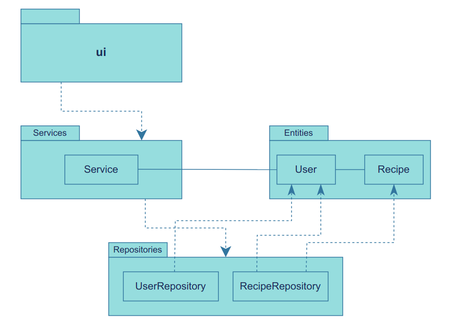

# Arkkitehtuurikuvaus

## Rakenne

Ohjelma on rakennettu kolmitasoisen kerrosarkkitehtuurin periaatteita noudattaen.

### Pakkausrakenne


Pakkaus *ui* sisältää käyttöliittymästä, *services* sovelluslogiikasta ja *repositories* tietokantaoperaatiosta vastaavan koodin.
Pakkaus *entities* sisältää luokkia, jotka kuvastavat sovelluksen käyttämiä tietokohteita, *User* ja *Recipe*.

## Sovelluslogiikka

Sovelluslogiikasta vastaavat metodit on koottu omaan [Service-luokkaansa](https://github.com/SiniCode/ot-harjoitustyo/blob/main/src/services/service.py).
Käyttöliittymän toiminnallisuudet on toteutettu kutsumalla näitä metodeita.

Tietokantaoperaatiot on eristetty sovelluslogiikasta, joten Service-luokka
puolestaan kutsuu tarvittaessa niistä vastaavia luokkia [UserRepository](https://github.com/SiniCode/ot-harjoitustyo/blob/main/src/repositories/user_repository.py)
ja [RecipeRepository](https://github.com/SiniCode/ot-harjoitustyo/blob/main/src/repositories/recipe_repository.py).
Riippuvuudet repositorioluokkiin injektoidaan Service-luokan konstruktorikutsun yhteydessä.

Sovelluksen osien välisiä riippuvuuksia kuvaava luokka- ja pakkauskaavio:


## Tietojen pysyväistallennus

Käyttäjien tiedot ja reseptit tallennetaan SQLite-tietokantaan.
Tietokanta alustetaan ennen sovelluksen ensimmäistä käynnistystä komennolla:

```bash
poetry run invoke build
```

Tietokantaoperaatioista vastaavat *repositories*-pakkauksen luokat [UserRepository](https://github.com/SiniCode/ot-harjoitustyo/blob/main/src/repositories/user_repository.py)
ja [RecipeRepository](https://github.com/SiniCode/ot-harjoitustyo/blob/main/src/repositories/recipe_repository.py).

Tietokantatiedoston nimi määritellään sovelluksen juureen sijoitetussa konfiguraatiotiedostossa .env.

Tietokannassa on kolme taulua: Users, Recipes ja Ingredients. Taulut alustetaan initialize_database.py-tiedostossa.


## Esimerkki sovelluksen toiminnallisuudesta sekvenssikaaviona: sisään kirjautuminen

Kun käyttäjä avaa sovelluksen, näytöllä näkyvät vaihtoehdot, joista ensimmäinen on sisään kirjautuminen.
Käyttäjä kutsuu käyttöliittymän login-metodia antamalla näppäimistöltä komennon "1".
Sekvenssikaavio kuvaa, mitä sovelluksessa tapahtuu tämän jälkeen, jotta käyttäjä saadaan kirjattua sisään.


Käyttöliittymästä vastaava UI lukee käyttäjän syötteistä käyttäjätunnuksen ja salasanan 
ja antaa ne sitten parametreina sovelluslogiikasta vastaavan Service-luokan *login*-metodille.
Tämä metodi kutsuu puolestaan tietokantaoperaatioista vastaavan UserRepositoryn *find_by_username*-metodia,
jonka palauttaman arvon avulla tarkastetaan, että käyttäjätunnus ja salasana ovat valideja.
Jos käyttäjätunnus on olemassa ja salasana täsmää siihen, kirjautuminen onnistuu ja käyttöliittymä 
näyttää kirjautuneen käyttäjän toimintovaihtoehdot.
