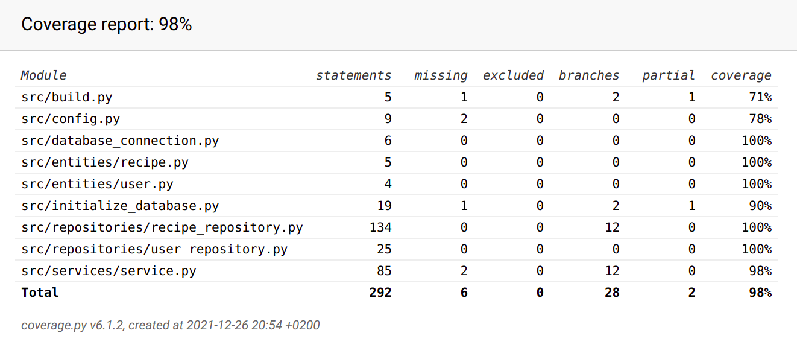

# Testausdokumentti

Ohjelman toimivuutta on testattu manuaalisesti sekä automaattisilla testeillä
unittestin avulla.
Kaikki [määrittelydokumentissa](https://github.com/SiniCode/ot-harjoitustyo/blob/main/dokumentaatio/vaatimusmaarittely.md)
listatut toiminnallisuudet on käyty läpi ja myös ohjelman selviytymistä
virheellisistä syötteistä on testattu.

## Automaattiset testit

### Sovelluslogiikka

Sovelluslogiikasta vastaavaa Service-luokkaa testaa luokka [TestService](https://github.com/SiniCode/ot-harjoitustyo/blob/main/src/tests/services/service_test.py).

### Repositorioluokat

Käyttäjiin liittyvistä tietokantaoperaatioista vastaavaa UserRepository-luokkaa
testaa luokka [TestUserRepository](https://github.com/SiniCode/ot-harjoitustyo/blob/main/src/tests/repositories/user_repository_test.py).
Reseptien tallennukseen ja hakuihin liittyvistä tietokantaoperaatioista
vastaavaa RecipeRepository-luokkaa testaa vastaavasti luokka
[TestRecipeRepository](https://github.com/SiniCode/ot-harjoitustyo/blob/main/src/tests/repositories/recipe_repository_test.py).

Repositorioluokkien testit käyttävät erillistä testitietokantaa, jonka iedostonimi
on konfiguroitu _.env.test_-tiedostoon.

### Testien haarautumakattavuus

Sovelluksen testauksen haarautumakattavuus on 98%.
Haarautumakattavuuden määrityksessä ei ole huomioitu käyttöliittymäkerrosta.

## Sovellukseen jääneet laatuongelmat

- Kun sovellus pyytää käyttäjältä tietoa, kirjoitusvirheitä ei pysty korjaamaan.
  Backspace-näppäin ei toimi ollenkaan, ja vaikka nuolinäppäimillä korjaus näyttää
  toimivan, tieto ei kuitenkaan tallennu oikein.

- Sovellus ei toimi, jos SQLite tietokantaa ei ole alustettu, eikä sovellus
  osaa neuvoa suorittamaan alustuskomentoa `poetry run invoke build`.
